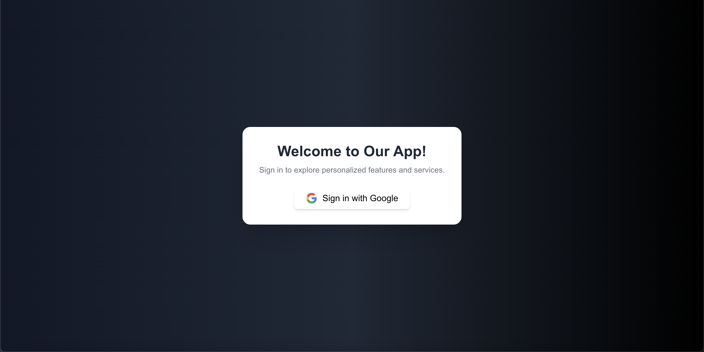

# 📋 Google Sign-In with Next.js, Firebase, Tailwind CSS, and FontAwesome

Welcome to this project! This repository demonstrates how to integrate **Google Sign-In** with **Firebase Authentication** using **Next.js**, **TypeScript**, **Tailwind CSS**, and **FontAwesome** icons.

---

## 🚀 Features

- 🔥 Firebase Google Authentication with pop-up sign-in
- 🎨 Stylish UI built with **Tailwind CSS**
- 🌐 Responsive design for both desktop and mobile views
- 🎩 FontAwesome icons for aesthetic appeal
- 💾 User data stored in **Firebase Realtime Database**

---

## 🛠️ Technologies Used

- [Next.js](https://nextjs.org/) – React-based framework for SSR and SSG
- [Firebase](https://firebase.google.com/) – Authentication and Realtime Database
- [Tailwind CSS](https://tailwindcss.com/) – Utility-first CSS framework
- [FontAwesome](https://fontawesome.com/) – Icon library

---

---

## 🖼️ Screenshots

Here’s a preview of the **UI design** and **Google Sign-In flow**:

### 📱 Desktop View

---

